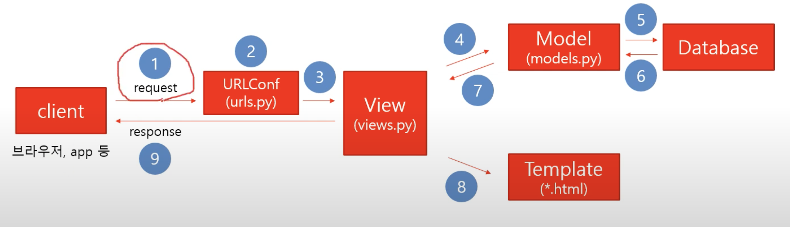

# Django 프로젝트 설계 및 흐름 이해하기
## MVT 모델

## 흐름도



# UrldConf (urls.py)
url을 매핑 해주는 역할을 하는 소스 파일

### urlpatterns
url을 매핑해서 View와 연결해준다.

### 형식 
``` python
urlpatterns = [
    path(경로, 뷰),
]
```
### ex)
```python
  urlpatterns = [
    path('admin/', admin.site.urls),
    path('student/', student.urls);
]
```

# View (view.py)
클라이언트 요청에 따른 애플리케이션 실행 결좌를 Template(html), 에러메시지등을 이용해서 클라이언트한테
response 한다.

### 형식
```python
def registerStudent(request) :
  return HttpResponse() 
```

# Model (model.py) 
### ORM
class를 이용하여 DB와 매핑을 하며 DB와 중간 다리 역할을 해준다.

```python
  class Student(models.Model): 
    s_name = models.CharField(max_length = 30)
    s_major = models.CharField(amx_length = 30)
```


# Template (*.html)
 - 템플릿은 templates폴더를 만들고 안에서 관리한다.
 - settings에 INSTALLED_APPS, TEMPLATES를 설정한다.

### settings.py - INSTALLED_APPS, TEMPLATES
### ex)
```python
  추후에 추가
```

# 기본 설정(settings.py, settings.pjt)
- 사용하는 라이브러리(모듈)을 등록한다.
- host할 IP
- DEBUG모드 - 배포시 false로 바꾸고 배포 
- 쿠키 SECRET KEY

```python
#사용하는 라이브러리(모듈)을 등록
INSTALLED_APPS = [
    'django.contrib.admin',
    'django.contrib.auth',
    'django.contrib.contenttypes',
    'django.contrib.sessions',
    'django.contrib.messages',
    'django.contrib.staticfiles',
]

#DEBUG모드
DEBUG = True

#host할 IP
ALLOWED_HOSTS = []

#쿠키 SECRET KEY 
SECRET_KEY = '*4k#d^$yw-t@kdau5q%khuwmlo=iq%(qtld(v9=+fm573hiwt-'
```

# 로컬에서 python 서버 구동하는 법
 python manage.py runserver 127.0.0.1:8000
 

 # DjangoProject 만들기
 ```
 django-admin startproject myProjectName
 ```